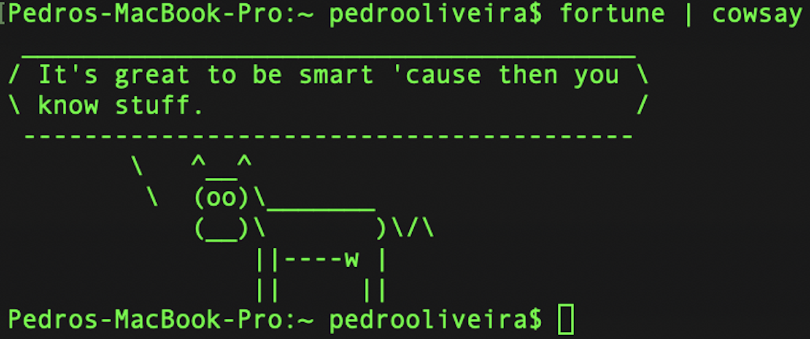

🌍
[English](README.md) ∙ [Français](README-fr.md) ∙ [Português](README-pt.md)

# Useful bash/python/perl one-liners and bioinformatic tutorials

*Note: This guide provides an overview of useful one-line UNIX commands and commonly used analyses in the bioinformatic arena. It is intended for a beginner audience and is permanently growing. Suggestions for improving this resource are more than welcome. Please drop me a line if you would like to contribute. –[Github](https://github.com/pedrocas81), [Webpage](http://www.pholiveira.net). Thank you!*

- [Unix under MacOSX](#unix-under-macosx)
- [Unix under Windows](#unix-under-windows)
- [Requirements](#requirements)
- [Basic Awk & Sed](#basic-awk-sed)
- [DNA, words](#dna-words)
- [FASTA/Q handling](#fasta/q-handling)
- [More resources](#more-resources)

## Requirements

# Unix under MacOSX

- Mac OS X comes stocked with an application named Terminal. You can find it under Finder → Applications → Utilities → Terminal. If you expect to use the Terminal a lot, drag the Terminal icon from the Finder window onto the Dock. You can then launch Terminal with a single click.

- For convenience, you should then set up a package manager to install new software within the Terminal.
  
  - Download and install Xcode, Apple’s software development application.
  
  - Download and install the Command Line Tools for Xcode (input the following command string in Terminal):
  
		xcode-select —install
  	
  - Download and install a free package manager such as [Homebrew](https://brew.sh) and/or [MacPorts](https://www.macports.org).

# Unix under Windows

- You can access the power of the Unix shell under Microsoft Windows by installing [Cygwin](https://cygwin.com/). Most of the things described in this document will work out of the box.

- On Windows 10, you can use [Windows Subsystem for Linux (WSL)](https://msdn.microsoft.com/commandline/wsl/about), which provides a familiar Bash environment with Unix command line utilities.

- If you mainly want to use GNU developer tools (such as GCC) on Windows, consider [MinGW](http://www.mingw.org/) and its [MSYS](http://www.mingw.org/wiki/msys) package, which provides utilities such as bash, gawk, make and grep. MSYS doesn't have all the features compared to Cygwin. MinGW is particularly useful for creating native Windows ports of Unix tools.

- You can also install [Homebrew](https://docs.brew.sh/Homexbrew-on-Linux) on Windows Subsystem for Linux (WSL).

# Dummy test files
For convenience, I am providing test files to all the commands below. 
These comprise a FASTA file [in.fa](./in.fa), a numeric CSV file [in.csv](./in.csv), 
an ID file with FASTA headers [ID.txt](./ID.txt), a FASTQ file [in.fq](./in.fq), a motifs FASTA file [motifs.fa](./motifs.fa). 
Just open Terminal (in MacOSX) or Cygwin (for example) in Windows and have fun!

## Basic Awk & Sed

#### Extract columns/fields 1, 3, and 7 from in.csv:

	awk '{print $1,$3,$7}' in.csv
    
#### Extract lines 1, 3, and 7 from in.csv:

    cat in.csv | awk 'NR == 1 || NR == 3 || NR == 7'  
    
#### Count the number of unique lines in in.csv:

	cat in.csv | sort | uniq | wc -l
      
#### Print every fifth line:

    awk 'NR % 5 == 0' in.csv
    
#### Print every fifth line starting at the third line:

    awk 'NR % 5 == 3' in.csv
    
#### Print everything except the first line:
    
    awk 'NR > 1' in.csv
    
#### Print everything except the last line:
    
    sed \$d in.csv
    
#### Print between (and including) rows 10-20:
    
    awk 'NR>=10&&NR<=20' in.csv
    
#### Delete blank lines in file:

    sed '/^$/d' in.csv
    
#### Delete lines with string (e.g.: 99):

    sed '/99/d' in.csv
    
#### Uniq on one column (field 3):

    awk '!arr[$3]++' in.csv
    
#### Replace all occurrences of 23 with 99:
    
    sed 's/23/99/g' in.csv

#### Compute the mean of column 3:
    
    awk '{x+=$3}END{print x/NR}' in.csv
    
#### Compute the median of column 3:
    
    sort -nk3,3 in.csv | awk 'NF{a[NR]=$3;p++} END {print (p%2==0)?(a[int(p/2)+1]+a[int(p/2)])/2:a[int(p/2)+1]}'
    
#### Transpose file:
    
    awk '{for (i=1; i<=NF; i++)  {a[NR,i] = $i}} NF>p { p = NF } END {for(k=1; k<=p; k++) {z=a[1,k];for(i=2; i<=NR; i++){z=z" "a[i,k];} print z}}' in.csv

#### Compare two files based on 1st field and output difference.

    awk 'FNR==NR{a[$1]++;next}!a[$1]' in1.csv in2.csv
    
#### Compare 1st, 2nd, and 3rd fields of in1.csv with 1st, 4th and 5th fields of in2.csv. Only matching rows in in2.csv will be printed.
    
    awk 'NR==FNR{a[$1,$2,$3]++;next} (a[$1,$4,$5])' in1.csv in2.csv

#### Print one line after (A) and two lines before (B) the matching regex (e.g.:99).

    grep -A1 -B2 '99' in.csv

## DNA, words

#### Print all possible 4-mer DNA sequence combinations:

    echo {A,C,T,G}{A,C,T,G}{A,C,T,G}{A,C,T,G}
    
#### Generate a list of 10 random integers between 100 and 200:
    
    awk -v min=100 -v max=200 -v freq=10 'BEGIN{srand(); for(i=0;i<freq;i++) print int(min+rand()*(max-min+1))}'
    
#### Reverse complement DNA sequence (e.g.: ATGCA):
    
    echo ATGCA | perl -nle 'print map{$_ =~ tr/ACGT/TGCA/; $_} reverse split("",$_)'
    
    
## FASTA/Q handling

#### Obtain md5 checksums of FASTQ files:

    ls *.fq | parallel md5sum {} > Checksums.txt

#### Convert FASTQ to FASTA:
    
    awk 'NR%4==1{print ">"substr($0,2)}NR%4==2{print $0}' in.fq > out.fa

#### Split multi-FASTA file into individual FASTA files:
    
    awk '/^>/ {tmp=substr($0,2) ".fa"}; {print >> tmp; close(tmp)}' in.fa
    
#### Extract FASTA sequences from in.fa using IDs stored in ID.txt:
    
    perl -ne 'if(/^>(\S+)/){$p=$i{$1}}$p?print:chomp;$i{$_}=1 if @ARGV' ID.txt in.fa

#### Linearize multi-FASTA sequences:
    
    awk '/^>/ {printf("%s%s\t",(N>0?"\n":""),$0);N++;next;} {printf("%s",$0);} END {printf("\n");}' in.fa
    
#### Sequence length of every entry in a multifasta file:

    awk '/^>/ {if (seqlen){print seqlen}; print ;seqlen=0;next;}{seqlen = seqlen + length($0)} END {print seqlen}' in.fa
    
#### Convert two column file format to FASTA format:
    
    awk '{print ">" $1,"\n" $2;}' in.txt
    
#### Compute all occurrences and start-end positions of the motif TCTAWA in a FASTA file:    
    
- One great option is to install [SeqKit](https://bioinf.shenwei.me/seqkit/download/) and run it as:

		seqkit locate --ignore-case --degenerate --pattern TCTAWA in.fa
	
	In the case above, we are asking seqkit to locate all the positions of the degenerate motif TCTAWA in a FASTA file (in.fa).
	In case we have multiple motifs to test, we can just assemble them in a FASTA format (motifs.fa file): 
	
		seqkit locate --ignore-case --degenerate -f motifs.fa in.fa

#### Run FASTQC on your FASTQ files:

- First install FASTQC (for example using brew):

		brew install fastqc

	Then simply run (if you want to do it in parallel 12 jobs at a time):
	
    	find *.fq | parallel -j 12 "fastqc {} --outdir ."
    
	This will produce a FASTQC HTML report and a ZIP file containing all associated files.
    
			
    
    
## More resources

- [awesome-shell](https://github.com/alebcay/awesome-shell): A curated list of shell tools and resources.
- [awesome-osx-command-line](https://github.com/herrbischoff/awesome-osx-command-line): A more in-depth guide for the macOS command line.
- [Strict mode](http://redsymbol.net/articles/unofficial-bash-strict-mode/) for writing better shell scripts.
- [shellcheck](https://github.com/koalaman/shellcheck): A shell script static analysis tool. Essentially, lint for bash/sh/zsh.
- [Filenames and Pathnames in Shell](http://www.dwheeler.com/essays/filenames-in-shell.html): The sadly complex minutiae on how to handle filenames correctly in shell scripts.
- [Data Science at the Command Line](http://datascienceatthecommandline.com/#tools): More commands and tools helpful for doing data science, from the book of the same name.
